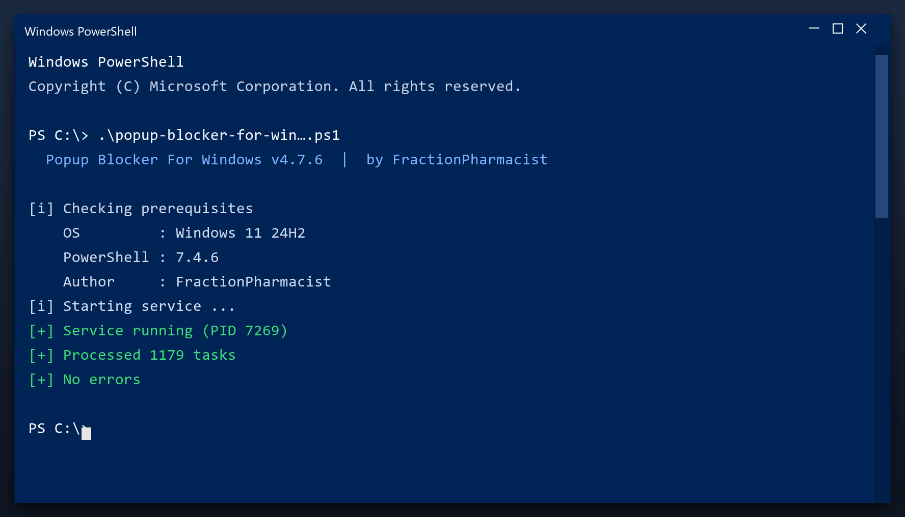

# Popup Blocker For Windows — Free 2026 Download

 

Popup blocker for windows is a lightweight Windows program for maintaining your system. It runs offline, uses very little memory and does not slow your computer down. **Completely free.**

  

  

## Specification

| | |
| --- | --- |
| **Program** | Popup Blocker For Windows |
| **Version** | Latest 2026 build |
| **Price** | Free |
| **Systems** | see requirements below |
| **Download** | Quick Start section below |

| **Feature** | **Details** |
| --- | --- |
| **Windows** | 11, 10 (64-bit) |
| **Scan time** | 1-3 minutes |
| **Backup** | Automatic before changes |
| **Memory use** | Very low |
| **Price** | Free |
| **Internet** | Not required to run |

## Requirements

| **Component** | **Details** |
| --- | --- |
| **OS** | Windows 10, 11 |
| **Architecture** | 64-bit |
| **RAM** | 2 GB minimum |
| **Disk space** | 100 MB |
| **Admin rights** | Yes, for cleanup tasks |
| **Internet** | Only to download |

## Installation

1. **Download** and unzip the package
2. **Right-click** the program and choose Run as administrator
3. **Choose a scan type** (quick or deep)
4. **Wait** for the report
5. **Select** the items to remove and confirm

> **Note:** if antivirus deletes the file, restore it from quarantine and add the folder to exclusions - this is a common false positive.

## Comparison

| **Feature** | **Other free tools** | **popup blocker for windows** |
| --- | --- | --- |
| **Bundled adware** | Often | Never |
| **Accounts** | Sometimes | Not needed |
| **Telemetry** | Often on | Off |
| **Cost** | Free with upsells | Free |

## Package Contents

| **Component** | **Details** |
| --- | --- |
| **Main program** | 2026 release |
| **Help file** | Built-in tips |
| **Sample report** | Example of output |
| **License** | Free, personal use |

## Description

In short: popup blocker for windows cleans up your PC and fixes small problems that build up over time. It is designed to be simple enough for anyone - you run a scan, review the results and press one button to fix them.

| **Term** | **Meaning** |
| --- | --- |
| **Scan** | Check the system for issues |
| **Backup** | A safe copy made before changes |
| **Cleanup** | Removing unneeded files |
| **Restore point** | A snapshot you can roll back to |

## Troubleshooting

| **Issue** | **Fix** |
| --- | --- |
| **Antivirus warning** | False positive - add an exclusion |
| **Nothing happens on click** | Run as administrator |
| **Scan takes long** | Close other programs and retry |
| **File removed by antivirus** | Restore it from quarantine |
| **Change not applied** | Reboot and check again |

## FAQ

**Is popup blocker for windows free?**

Yes - the full version, no registration and no hidden payments.

**Is it safe?**

The build is scanned and tested. It creates a restore point before making changes.

**Does it work on Windows 11?**

Yes, and on Windows 10 (64-bit).

**Will it delete my files?**

No. It only removes temporary and leftover files, not your documents or photos.

**Do I need the internet?**

Only to download it. After that it works offline.

**Where do I download it?**

Use the green button in the Quick Start section above.

---

*pristine-pelican-409 · Updated 2026-10-09 · Shared under the MIT License*
